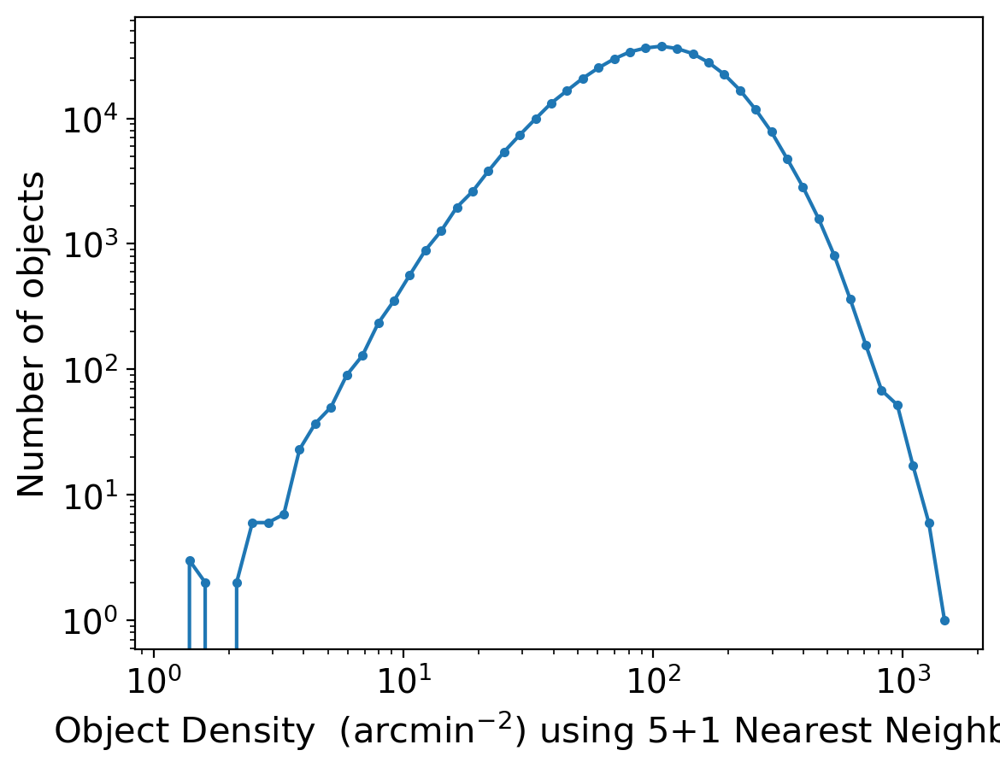
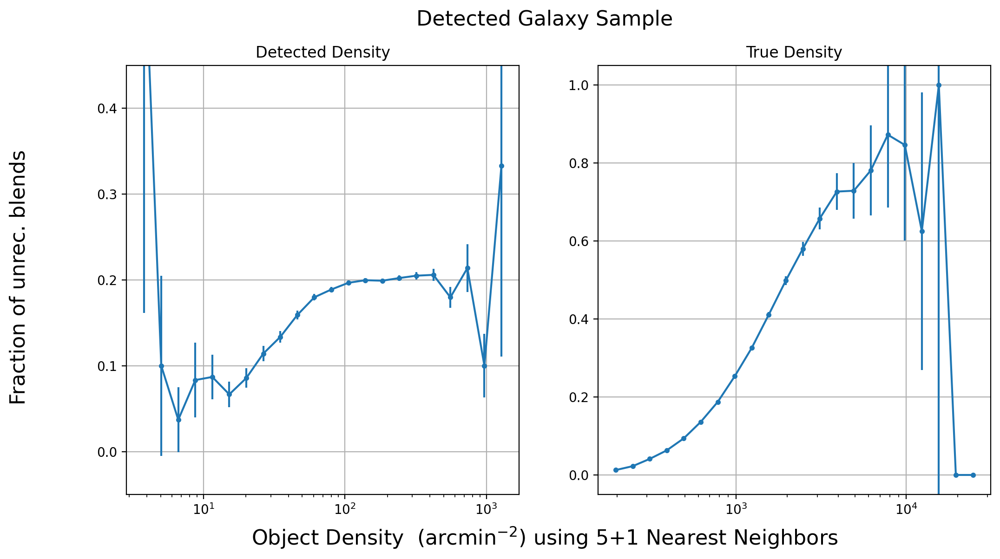
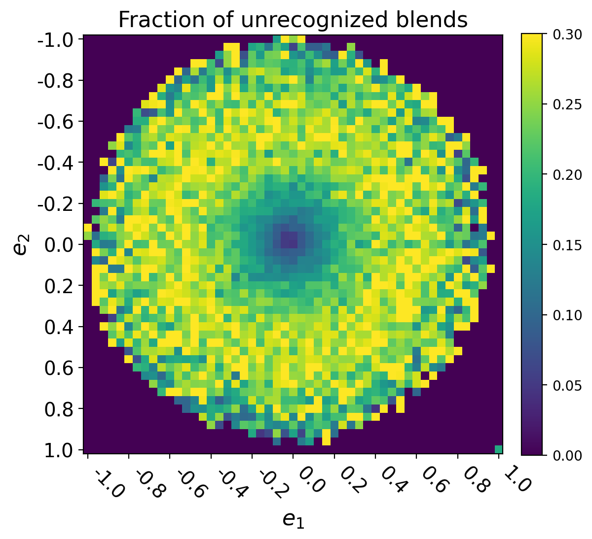

#############################################
Unrecognized Blends in Operations Rehearsal 3
#############################################

.. abstract::

   Unrecognized blends are blended objects that are mistakenly identified as a single object, usually due to a high degree of overlap caused by ground based seeing.
   Using a truth catalog we can label detected objects as unrecognized blends and begin to characterize them.
   We implement a simple matching algorithm using the RA and DEC of objects to label observed objects as isolated objects, recognized blends, or unrecognized blends.
   Finally, we investigate how the rate of unrecognized blends varies with various object properties such as observed i-mag and local density.
..   Using a space based catalog we can attempt to match objects between the two and identify any unrecognized blends. In this technote we use the truth catalogs as a proxy and create a simple matching algorithm between truth and observation to label recognized and unrecognized blends. We then investigate how the rate of unrecognized blends varies with object properties such as i-mag and local density.

Data
===============
The Operations Rehearsal 3 simulated 3 nights of commissioning observations.
We use the "Intermittent Cumulative DRP" catalog which was produced by the pipeline at the time processing all 3 nights of data.
The catalog can be accessed using the :code:`/repo/embargo` repo and found in the :code:`LSSTComCamSim/runs/intermittentcumulativeDRP/20240402_03_04/d_2024_03_29/DM-43865` collection.
The simulated images are built on top of a set of DC2 patches with input catalogs in :code:`/sdf/data/rubin/shared/ops-rehearsals/ops-rehearsal-3/imSim_catalogs`. 
The truth catalogs include galaxies, stars, and solar system objects of which we look at galaxies and stars. 
During commissioning and actual observations, we intend to use a space based catalog over the same patch of sky to label detected objects.
Space based observations have better seeing and are less prone to blending.

Part of the processing in the LSST pipeline includes passing recognized blends through a deblender. 
In order to work with the deblended children, remove sky objects, and only on inner regions we apply filter using the :code:`detect_isPrimary` flag which helps guarantee unique entries and deal with recognized blends.
There are certain issues when applying cuts to data before matching as it can lead to recognized blends being labelled as unrecognized if one of the ground objects is removed from a cut.
However, the cut guarantees that rows are unique which is necessary for us to match objects and offers a good starting point for basic studies of unrecognized blends. 

.. note::
   The isDeblended flag won't lead to any issues but the other two components of detect_isPrimary may lead to some spurious labels.
   It would be worthwhile to see how much things change when we do this the proper way, matching first then applying any data cuts. 

.. note::
   For most of this technote, the phrase "observed galaxies" and "extended objects" will be used interchangibly and correspond to objects with refExtendedness==1 from the object table.

Matching
========
One of the easiest ways to match objects is using position information from the ground catalog, like RA and DEC, and matching with the nearest object in the space based catalog.
This works well for non-blended objects after aligning astrometry, however for blends there will be multiple objects in the space based catalog any of which maybe the correct choice.
Additional information such as shape parameters or photometry can be included and assign the correct match between the two catalogs.
However, to label unrecognized blends we can use a simpler scheme that does not do proper matching, but instead focuses on counts.
For a ground object at position :math:`\vec{p}`, we count the number of space objects, :math:`N_s`, and the number of ground objects :math:`N_g`, that are within a small radius :math:`r`.
If we have :math:`N_s > N_g`, we have a *candidate unrecognized blend*.
If :math:`N_s \leq N_g`, we have a **recognized blend** or **spurious detections**.

To promote a candidate unrecognized blend, we apply two magnitude cuts on the *i-mag* on the matched space objects.
If we still have :math:`N_s > N_g` after applying the cuts, the object is labeled an **unrecognized blend**.
To account for the large number of faint unresolved galaxies that exist in a simulation, we require that all space objects be brighter than some magnitude :math:`m_b`.
While there will be a large number of faint galaxies in LSST, the very faint end will also have a large number of spurious detections in a space catalog.
The second cut comes from an analysis point of view, a 23 *i-mag* galaxy blended with a 26 *i-mag* galaxy will be completely dominated by the brighter galaxy and make any effect of blending minimal to undetectable.
We require that the difference between the brightest space galaxy and any other in th set be less than :math:`\Delta_m`.
We default to :math:`\Delta_m = 2.5` and :math:`m_b = 28` however these are flexible parameters that can be varied.

A quick note on implementation, we use kd trees to allow for rapid querying of positions and neighbors in both catalogs.
This allows us to quickly get :math:`N_s` and :math:`N_g` while applying the magnitude cuts can be expensive and require a look-up table.
Finally, this scheme is easily applied to single visits and co-adds.

In summary we have:

1. Align astrometry.
2. Find space objects around the ground object within radius :math:`r`, :math:`\tilde{N}_s`.
3. Find ground objects around thre ground object within radius :math:`r`, :math:`N_g`.
#. Filter out space objects that are too dim (:math:`m_{b}`) or too dim compared to the brightest object (:math:`\Delta_m`), :math:`N_s`.
#. Compare :math:`N_s` and :math:`N_g` and label unrecognized blends if :math:`N_s > N_g`.

This is one of several matching schemes to assign unrecognized blends.
Shuang's ellipse matching scheme includes shape parameters to recreate galaxies as ellipses and estimate the amount of overlap in the space based catalog.
Manon's :code:`friendly` algorithm creates a graph network between the two catalogs to assign objects a *blend entropy*.
The blend entropy is a positive number that is higher for more problematic blends allowing for tuning based on use case.
While :code:`friendly` was not run on OR3 data, it was run on DC2 simulations and results are shown below. 

Recognized Blends
===================
As mentioned above, matching with RA/DEC is fast using the k-d tree but applying magnitude cuts and magnitude difference cuts can be slow.
It is worthwhile to reduce the number of candidates which motivates choosing a :math:`r` that will avoid most recognized blends.
We can look at the distance between objects in recognized blends and choose a radius that rejects most of these blends.
We use a distance of 1'' as :math:`> 99\%` of recognized blends are larger while also allowing for any issues with astrometry or centroid algorithms.

Figure 1. Distribution of distance between deblended children in the same parent. 

.. We have no further use for recognized blends but it is possible to assign each detected ground object a :code:`primary-match` that then allows for direct comaprison against the space measurements and getting the error in galaxy photometry, shape measurements, and photo-z.

Unrecognized Blends
==============================

Using the kd-tree matching algorithm we can label unrecognized blends in the ground catalog. 
We then investigate how unrecognized blends correlate with various parameters such as object i-magnitude, shape parameters, and local density.

Magnitude Dependence
--------------------------

The fraction of unrecognized blends as a function of the observed *i-mag* is shown below including the results using :code:`friendly` on DC2.

.. image:: _static/unrec_blend_dc2_comparison.png

Figure 2.  Fraction of unrecognized blends as a function of observed *i-mag*. The kd results are shown in blue and results using blend entropy in orange. The two show a similar bump at the faint end while there is not strict agreement.

If we restrict to only detected galaxies we se a slight increase

.. image:: ./_static/unrec_blend_extended.png

Figure 3. Fraction of unrecognized blend as a function of observed i-mag including a restriction on only observed galaxies. There is a slight increase corresponding to extended objects being easier to overlap with.

Shape Parameters
-----------------
We look at the second moment, :math:`Q_{ij}`, of extended objects.
We combine the second moments via 

.. math::
   e_1 = \frac{Q_{xx} - Q_{yy}}{Q_{xx} + Q_{yy}} \;\;\; e_2 = \frac{2Q_{xy}}{Q_{xx} + Q_{yy}}

We create :math:`Q_{rr} = \sqrt{Q_{xx}^2 + Q_{yy}^2}`.

.. image:: ./_static/unrec_blend_shapeij.png

Figure 4. Fraction of unrecognized blend as a function of measured second moments on observed galaxies. The range is limited to the 95% range for each measurement.

.. image:: ./_static/unrec_blend_pol.png

Figure 5. Fraction of unrecognized blend as a function of ellipse polarization on observed galaxies.

Local Density
--------------

To estimate the local density, :math:`\sum(r_i)`, we use Equation 7 from `Darvish et al <https://arxiv.org/pdf/1503.07879.pdf>`_.

.. math::
   \sum(r_i) = \frac{\sum_{j=1}^k j}{\pi \sum_{j=1}^k d_{ij}^2}

Where :math:`d_{ij}` is the distance between object :math:`i` and :math:`j`.
When querying for neighbors, we can either look at the object catalog when testing the pipeline or the truth catalog when testing for science.
There will likely be some underlying science that can be extracted by using the truth catalog density but we limit our focus to the detected catalog to test the pipeline.

The distribution of density and the relationship with unrecognized blends are shown below

Figure 6. Log scale histogram of object density using 5 neighbors.

Figure 7. Fraction of unrecognized blend as a function of local detected density (left) and local true density (right). As expected, the fraction of unrecognized blends monotonically increases with true density however the observed density flat-lines.

Heatmaps
---------

We also make some heatmaps to see how multiple variables interact.

Figure 7. Fraction of unrecognized blend 

Conclusion
==========

We have created a set of tools that enable us to match between catalogs to label unrecognized blends and investigate how the rate of unrecognized blends vary with object properties.
Basic characteriziation can help us inform us when designing ML algorithms to predict unrecognized blends when we don't have access to high quality space based data.
During commissioning and observation we intend to re-do this analysis using space based data which will enable future studies on unrecognized blends and how to mitigate them.

