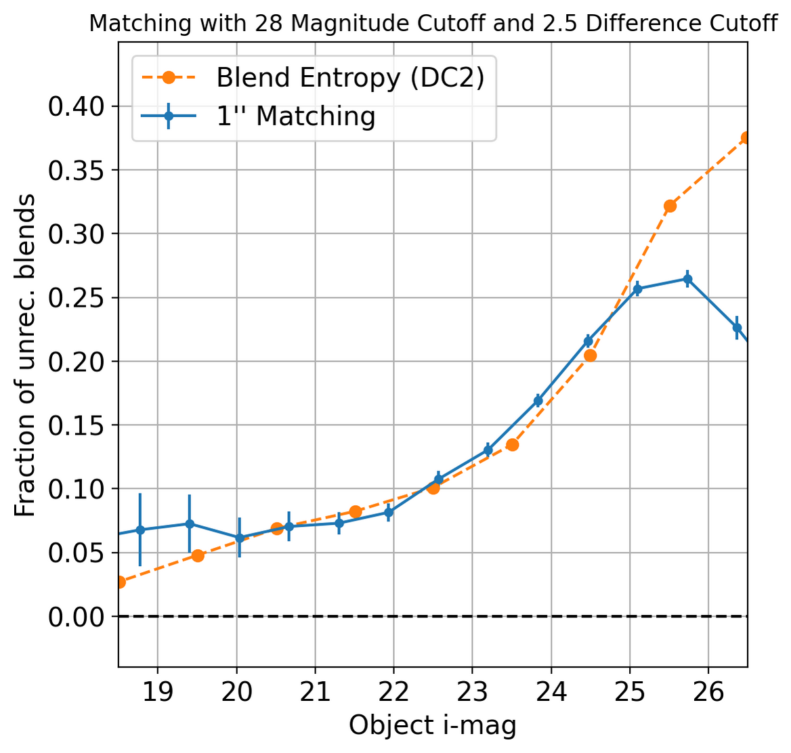
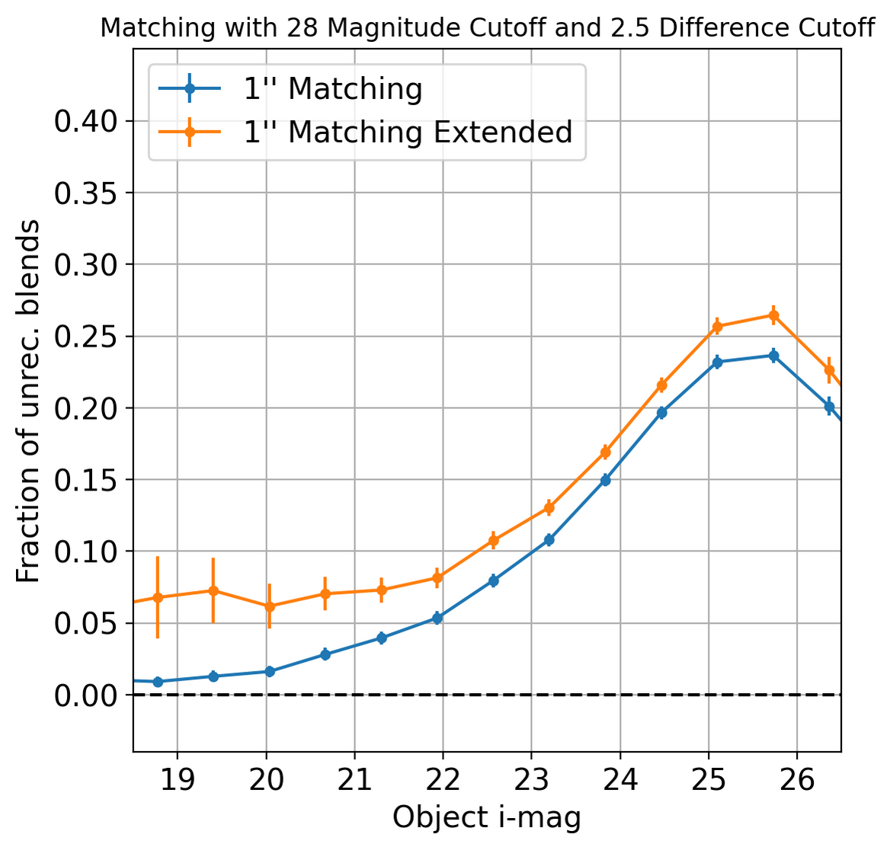
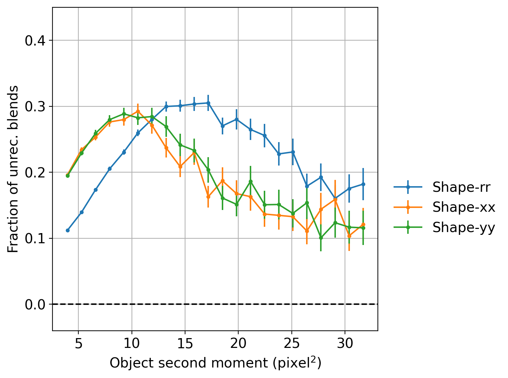
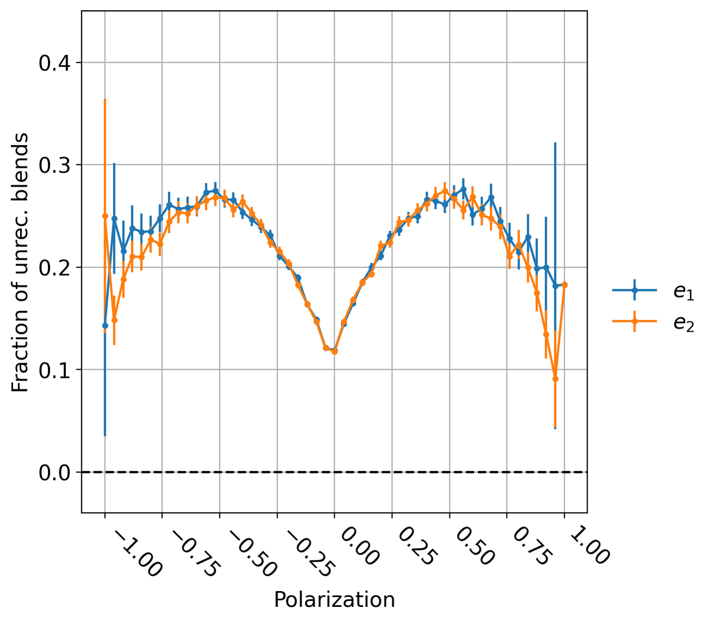
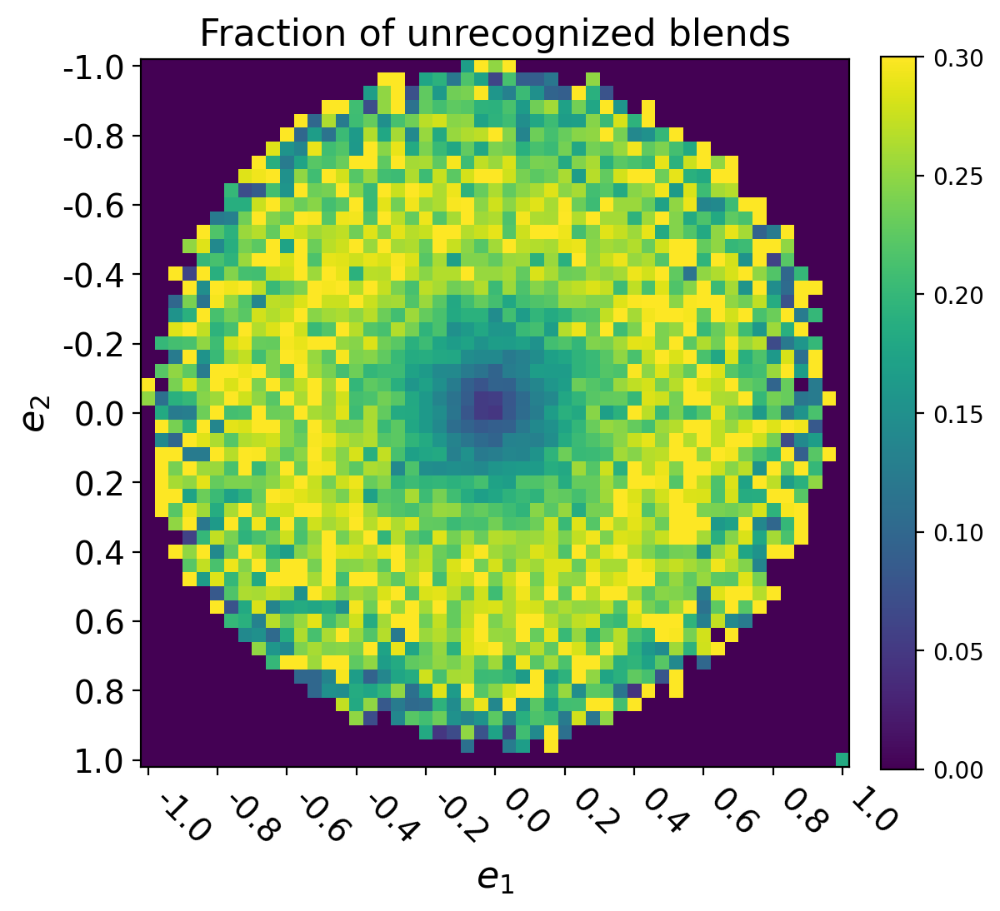
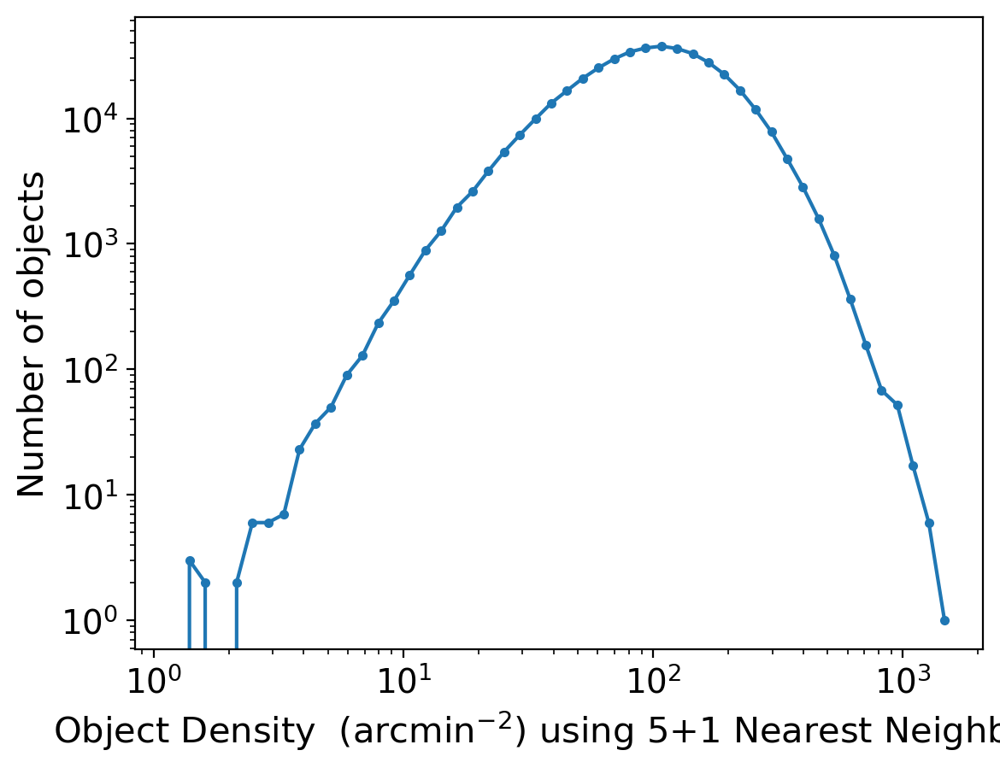
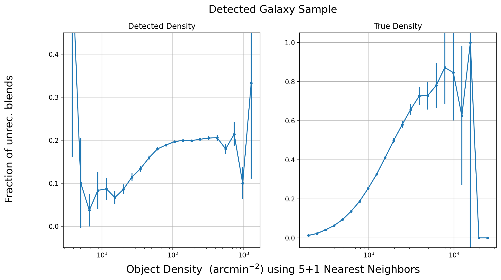

#############################################
Unrecognized Blends in Operations Rehearsal 3
#############################################

.. abstract::
   Unrecognized blends are a class of blended objects that are mistakenly identified as a single object.
   We can identify such objects using higher resolution imaging from a space based telescope that is not affected by ground based seeing or in the Operations Rehearsal 3, use the simulation truth catalog.
   Using RA and DEC we can match between the two catalogs to label observed objects as isolated objects, recognized blends, or unrecognized blends.
   This allows us to investigate the fraction of unrecognied blends present and how different factors influence that rate.
   We have performed a variety of tests into unrecognized blends on the simulated data which can act as a benchmark for upcoming commissioning where we will have to use a space based catalog to match.
..   Using a space based catalog we can attempt to match objects between the two and identify any unrecognized blends. In this technote we use the truth catalogs as a proxy and create a simple matching algorithm between truth and observation to label recognized and unrecognized blends. We then investigate how the rate of unrecognized blends varies with object properties such as i-mag and local density.

Data
===============
..   * Introduce Operations Rehearsal 3 with 3 nights of simulation
   * We are using the "Intermittent Cumulative DRP" catalog

        * Also reference a nightly catalog/collection

   * We need to use the truth catalogs for matching
   * Truth catalogs use galaxies, stars, solar system objects and we are only looking at galaxies and stars
   * We apply the :code:`detect_isPrimary` flag which

        * Works with deblended children, removes sky objects, and is only inner regions
        * Might be a problem to apply cuts before matching but good for understandability
        * Double check!

   * In the observed catalog we only have :code:`extendedness` which is 1 for extended objects. We assume all extended objects are galaxies and use the two interchangibly 

The third Operations Rehearsal (OR3) simulated 3 nights of observation that were then processed by the science pipelines.
The simulations are built on top of a set of DC2 patches which were then processed to mimic realistic observational conditions.
We use both the nightly catalog and the cumulative co-add catalog.
The catalog can be accessed using the :code:`/repo/embargo` repo and found in the :code:`LSSTComCamSim/runs/intermittentcumulativeDRP/20240402_03_04/d_2024_03_29/DM-43865` collection.
The observed catalog goes through a detection and deblending step already to deal with ``recognized blends.``
In the science pipeline, the process of deblending produces children objects from a given parent object.
In order to remove duplicates from the catalog we work only with the deblended children and not parents along with two other quality control flags (not a sky object and in the inner region).
All three flags are combined into the :code:`detect_isPrimary` flag which we apply to the observed catalog.
In the observed catalog, a loose proxy for star-galaxy classification can be done via the :code:`extendedness` flag.
In this technote we will use "observed galaxy" and "extended object" interchangibly.

To label detected objects as isolated galaxies or unrecognized blends we require a higher resolution catalog which corresponds to space based data for actual operations and input truth for simulations.
The truth catalogs for this run include galaxies, stars, and solar system objects of which we only consider the galaxies and stars.
The input truth catalog for solar system objects does not include an *i*-magnitude and while they will cause blending, difference imaging is likely to offer much better mitigation of these sources than deblending.
The simulated images are built on top of a set of DC2 patches with input catalogs in :code:`/sdf/data/rubin/shared/ops-rehearsals/ops-rehearsal-3/imSim_catalogs`. 

Matching
========
..   * We have to match between the space (truth) and ground catalogs to label unrecognized blends

        * Maybe include the nice egg recognized/unrecognized graphic? 

   * Easiest way to match objects is to use RA and DEC (after aligning astrometry) and taking the nearest match
   * Matching can go either direction but let's use the ground based RA and DEC.
   * This plays very well with isolated galaxies but is problematic for blends
   * Instead of taking the nearest match, we can query for objects in a radius and focus on the count

        * Querying around the ground RA and DEC in the ground catalog we have :math:`N_g` ground objects
        * Querying around the ground RA and DEC in the space catalog we have :math:`N_s` space objects
        * If :math:`N_s > N_g` we have a *candidate unrecognized blend*
        * If :math:`N_s \leq N_g` we have a **recognized blend** or a **spurious detection**.

   * Promoting a *candidate unrecognized blend* requires the truth objects to pass 2 cuts:

        * :math:`\Delta i < 2.5`
        * :math:`m_b > 28`

   * We use kd-trees since they are good and fast at this sort of stuff
   * Can do this on source (single visit) and object table
   * Other options are available! Ellipse overlap + :code:`friendly` that gives *blend entropy*
   * :code:`friendly` is being integrated into the pipeline and results on DC2 (not directly on OR3) are shown below

Observed and truth catalogs in hand, we can start to label objects in the observed catalog as isolated objects (pure), recognized blends, or unrecognized blends by matching between the two catalogs.
After aligning astrometry, we can use position information (RA and DEC) to match objects between the two catalogs.
If we query around the ground based RA and DEC using a small radius we would expect to get a single match in the truth catalog for a pure galaxy whereas we would expect to see multiple for a blended object.
To differentiate between recognized and unrecognized blends, we would also need to query a small radius in the ground catalog with the recognized blends having an equal number of objects to that in the truth query while unrecognized blends will have fewer.
Formally, let :math:`N_g` be the number of ground catalog objects in some radius :math:`r` centered on the position of a ground object (:math:`N_g > 1` always), :math:`N_s` be the number of space catalog objects in some radius :math:`r` centered on the same position.
If :math:`N_s > N_g` we have a *candidate unrecognized blend* whereas the converse :math:`N_s \leq N_g` can be a **pure galaxy**, **recognized blend**, or spurious detection.

        .. Even if blending was not an issue we would not be able to create a clean one to one map between the two catalogs due to the truth catalog having dim objects that avoid detection and the observed catalog having spurious detections.

Once we have a set of candidate blends, we can apply magnitude cuts on these to isolate to the blends we anticipate to be problematic.
For each candidate, we require that the set of truth objects pass 2 cuts:

    1. The difference between a truth object and the brightest in the set in band X should be small :math:`\Delta_X < m_\Delta`
    2. The truth objects should not be too dim in band X :math:`m_X > m_b`

Once applying the cuts on the truth catalog we recount the number of objects in the sets and promote any surviving candidate unrecognized blends to candidate blends.
In summary we have the following process: 

   * To generate a candidate blend
        #.  Querying a radius :math:`r` around the ground RA and DEC in the ground catalog gives :math:`N_g` ground objects
        #.  Querying a radius :math:`r` around the ground RA and DEC in the space catalog gives :math:`N_s` space objects
        #.  If :math:`N_s > N_g` we have a *candidate unrecognized blend*
        #.  If :math:`N_s \leq N_g` we have a **recognized blend** or a **spurious detection**.

   * Promoting a *candidate unrecognized blend* requires the truth objects to pass 2 cuts:
        * :math:`\Delta_X < m_\Delta`
        * :math:`m_X > m_b`

It is important to note that this is not the only option to match for unrecognized blends. More complicated schemes include Shuang's ellipse matching algorithm and Manon's :code:`friendly` producing a blend entropy for each object.
:code:`friendly` is being implemented into the science pipelines but for comparison we present some results when used on DC2 simulations on NERSC.
One benefit to our naive matching scheme is that it allows us to use KDtrees which are fast and efficient.

.. 
        Recognized Blends
        ===================
        As mentioned above, matching with RA/DEC is fast using the k-d tree but applying magnitude cuts and magnitude difference cuts can be slow.
        It is worthwhile to reduce the number of candidates which motivates choosing a :math:`r` that will avoid most recognized blends.
        We can look at the distance between objects in recognized blends and choose a radius that rejects most of these blends.
        We use a distance of 1'' as :math:`> 99\%` of recognized blends are larger while also allowing for any issues with astrometry or centroid algorithms.

        .. image:: ./_static/recognized_blend_dist.png

        Figure 1. Distribution of distance between deblended children in the same parent. 

        .. We have no further use for recognized blends but it is possible to assign each detected ground object a :code:`primary-match` that then allows for direct comaprison against the space measurements and getting the error in galaxy photometry, shape measurements, and photo-z.

Unrecognized Blends
==============================

Using the kd-tree matching algorithm we can label unrecognized blends in the ground catalog. 
Our fiducial settings have :math:`r = 1''`, :math:`m_\Delta = 2.5`, and :math:`m_b = 28`.
We then investigate how unrecognized blends correlate with various parameters such as object i-magnitude, shape parameters, and local density.
During commissioning we can repeat this process on real data allowing for more robust tests of the science pipeline. 

Magnitude Dependence
--------------------------
We expect that blending will increase at the higher magnitudes as dimmer objects are easier to avoid detection and there are more galaxies.
Other studies of unrecognized have found a similar trend which we show below.

The fraction of unrecognized blends as a function of the observed *i-mag* is shown below including the results using :code:`friendly` on DC2.

   Fraction of unrecognized blends as a function of observed *i-mag*. The kd results are shown in blue and results using blend entropy in orange. The two show a similar bump at the faint end while there is not strict agreement.

If we restrict to only detected galaxies we se a slight increase

    Fraction of unrecognized blend as a function of observed i-mag including a restriction on only observed galaxies. There is a slight increase corresponding to extended objects being easier to overlap with.

Shape Parameters
-----------------
Accurate shape measurements is necessary for weak lensing studies and it is expected that unrecognized blends will greatly impact shear.
The inverse question, if certain shapes will impact unrecognized blends is not as well studied.
It is possible that there would be a bias due to the orientation of the pixel grid which we investigate below.

We look at the second moment, :math:`Q_{ij}`, of extended objects.
We combine the second moments via 

.. math::
   e_1 = \frac{Q_{xx} - Q_{yy}}{Q_{xx} + Q_{yy}} \;\;\; e_2 = \frac{2Q_{xy}}{Q_{xx} + Q_{yy}}

We create :math:`Q_{rr} = \sqrt{Q_{xx}^2 + Q_{yy}^2}`.

   
        Fraction of unrecognized blend as a function of measured second moments on observed galaxies. The range is limited to the 95% range for each measurement.

        Fraction of unrecognized blend as a function of ellipse polarization on observed galaxies.

Given that there is little to no difference among the shape parameters, this gives good confidence that the pixel grid is not impacting shape measurements and unrecognized blends in strange ways.
The wing structure is not necessarily cause for concern but it is interesting that objects with larger shapes tend to be unrecognized blends.
The bins at the edge of the torus have :math:`N\approx O(10)` so a larger sample is required for any definitive claim.

        Fraction of unrecognized blends as a function of ellipse polarizations on observed galaxies.

Local Density
--------------
Finally, we know clusters and other dense fields (like the deep fields) are expected to be extremely blended motivating looking into how local density affects unrecognized blend fraction.

To estimate the local density, :math:`\sum(r_i)`, we use Equation 7 from `Darvish et al <https://arxiv.org/pdf/1503.07879.pdf>`_.

.. math::
   \sum(r_i) = \frac{\sum_{j=1}^k j}{\pi \sum_{j=1}^k d_{ij}^2}

Where :math:`d_{ij}` is the distance between object :math:`i` and :math:`j`.
When querying for neighbors, we can either look at the object catalog when testing the pipeline or the truth catalog when testing for science.
There will likely be some underlying science that can be extracted by using the truth catalog density but we limit our focus to the detected catalog to test the pipeline.

The distribution of density and the relationship with unrecognized blends are shown below

        Log scale histogram of object density using 5 neighbors.

        Fraction of unrecognized blend as a function of local detected density (left) and local true density (right). 

As expected, the fraction of unrecognized blends monotonically increases with true density however the observed density flat-lines.

.. note:: 
    Removed the heatmaps section since I'm not sure what the actual take away is...

.. 
        Heatmaps
        ---------

        We also make some heatmaps to see how multiple variables interact.

        .. image:: ./_static/heatmap_e1_e2.png

        Figure 7. Fraction of unrecognized blend 

Conclusion
==========
We have created a set of tools that enable us to match between catalogs to label unrecognized blends and investigate how the rate of unrecognized blends vary with object properties.
This technote has the ideal case using simulated data along with true input catalogs which gives a good goalpost for commissioning data. 
During commissioning and observation we intend to re-do this analysis using space based data which will enable future studies on unrecognized blends and how to mitigate them.

