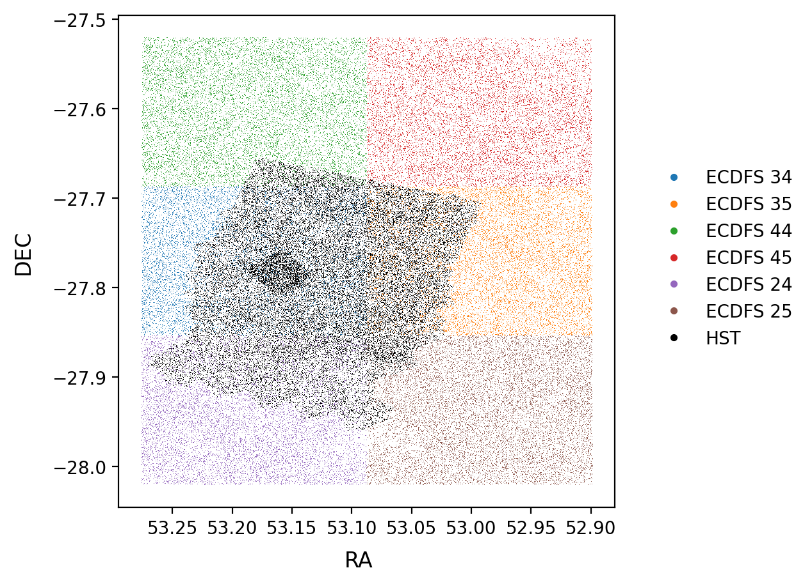
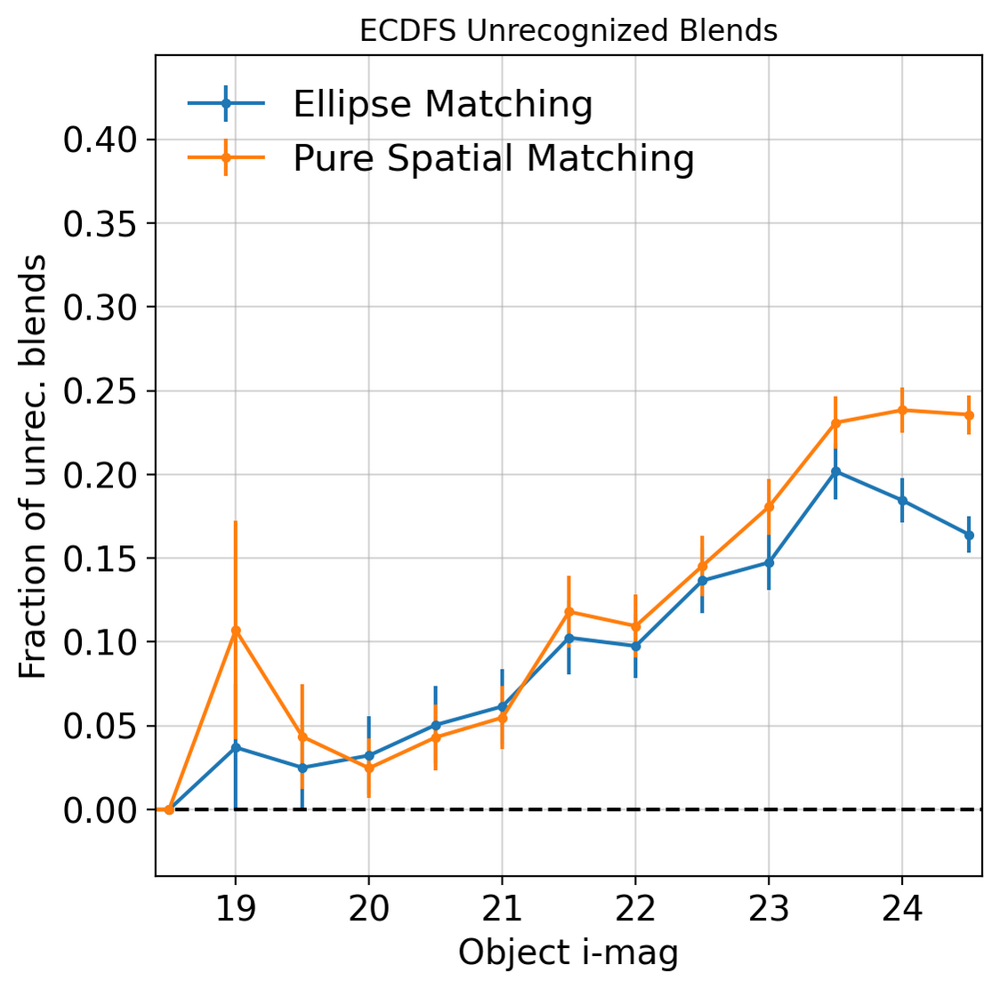
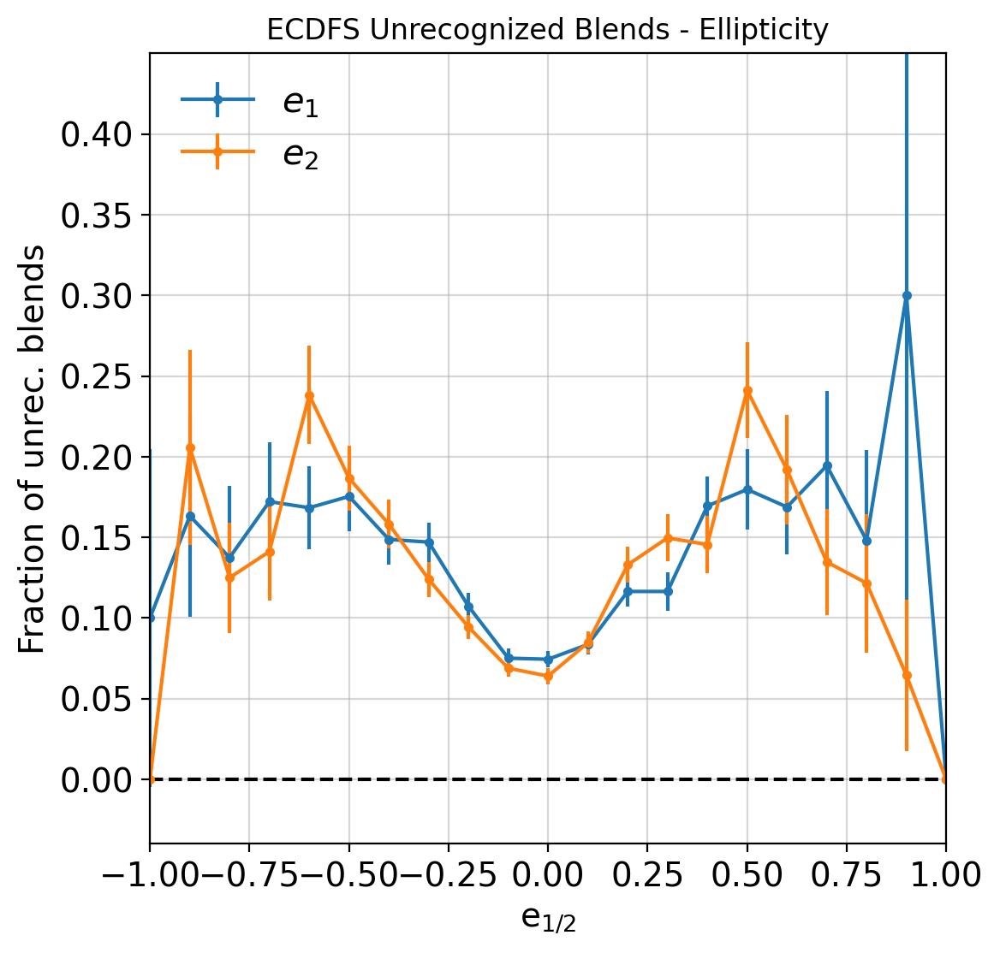
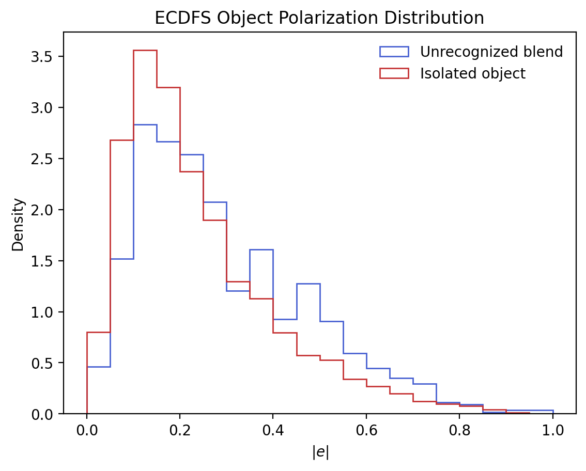
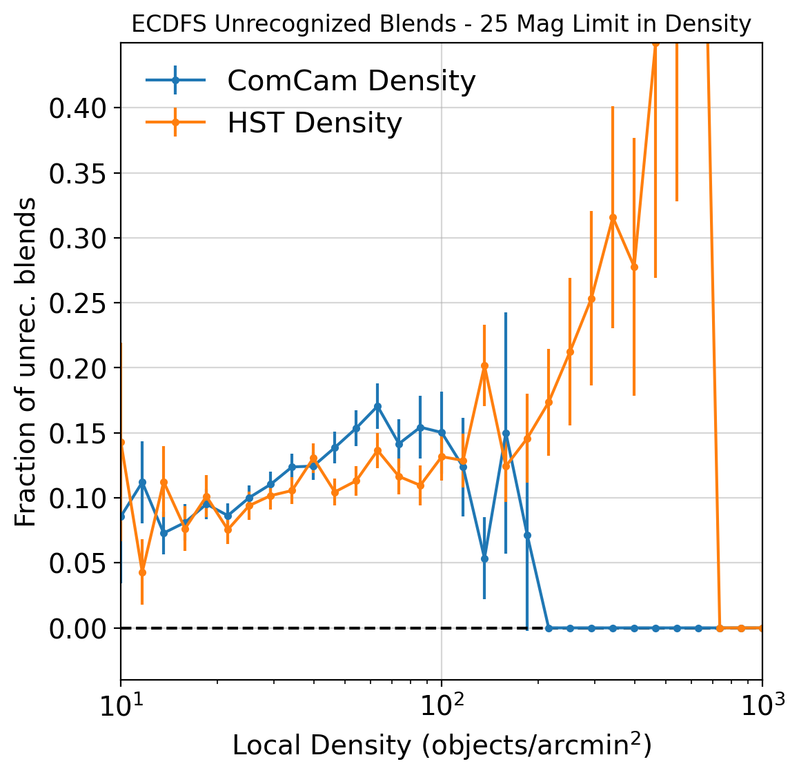
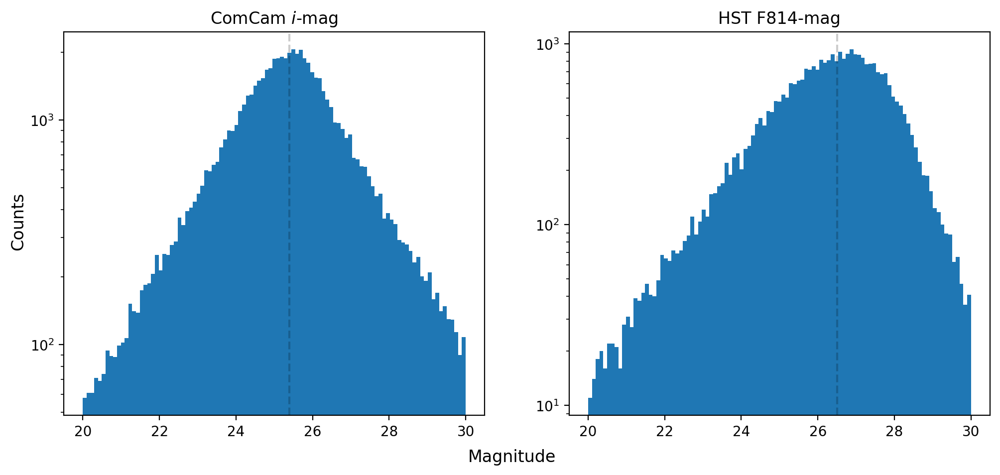

#############################################
Unrecognized Blends in ComCam ECDFS
#############################################

.. abstract::
   Unrecognized blends are a class of blended objects where two (or more) objects are so close on the sky that they are mistakenly identified as a single object.
   These objects can cause a variety of issues for science and simple validation. 
   We can identify such objects by using higher resolution imaging from a space based telescope that will not be affected by ground based seeing and then label detected objects as isolated, recognized blends, or unrecognized blends.
   We find that for objects with :math:`23 < i < 24.5`, 18\% of objects are unrecognized blends. 

Data
===============

The Extended Chandra Deep Field-South (ECDFS), or also known as GOODS-South, is an extension to the original Chandra Deep Field-South which was originally observed in X-Rays but has since been observed across many bands.
The Commissioning Camera (ComCam) observed this patch of sky with over 1000 visits in total, 250 being in the :math:`i`-band alone, similar to 10-year depth.
This data was then processed several times through the Rubin pipelines enabling rapid improvements to the entire system.
Unrecognized blends allow us to understand some of the inherent failure modes of object detection when objects are too close on the sky to be differentiated. 
We use the :code:`/repo/dp1` repo and :code:`LSSTComCam/runs/DRP/DP1/v29_0_0/DM-50260` collection for ComCam data along with HST CANDELS data. 

The DP1 catalog includes a :code:`deblending` algorithm which means with accurate detection it is able to parse isolated and "recognized blends."
Deblending produces "children" objects from a "parent object", both of which are in the catalog and needs to be pruned in order to remove duplicates. 
We apply the general :code:`detect_isPrimary` flag which removes the parent objects (if child object exist) from the catalog along with removing any sky objects and that the object is from the inner part of both a tract and a patch. 
We will use the terms "extended object" (defined by :code:`refExtendedness == 1`) and "observed galaxy" interchangibly.
We place two cuts on the HST catalog, that the F814W magnitude be brighter than  tunable value which we call the space magnitude (:math:`m_s`) and that :code:`FLAG == 0` which removes only 318 objects.
Details on the HST :code:`FLAG` parameter can be found `here <https://archive.stsci.edu/hlsps/candels/goods-s/catalogs/v1/hlsp_candels_hst_wfc3_goodss-tot-multiband_f160w_v1_readme.pdf>`_. 

The overlap between the two catalogs can be seen in :numref:`overlap` and the magnitude distribution (:math:`i` for ComCam and F814W for HST) in :numref:`magdist`.

.. _overlap:

        Footprint of the two surveys. HST is shown in black and DP1 data is shown in the non-black points. Each non-black color refers to a different patch in the ECDFS DP1 data.

Matching
========

Ground and space catalogs in hand, we can start to label objects in the ground catalog as isolated objects (pure), recognized blends, or unrecognized blends by matching between the two catalogs.
The general idea will be to generate a list of candidate unrecognized blends and then refine that list, e.g. by removing any unrecognized blends that are unlikely to be contaminated (a 23-mag blended with a 27 mag), as well as removing residual pure objects and recognized blends.

Seemingly the simplest way to match between the two catalogs would be to use pure spatial information, RA and DEC. 
Querying the ground and space catalogs within some :code:`search_radius` (which we choose to be the same for both catalogs) and then comparing the counts which can be done quickly using a k-d tree datastructure like the one implemented in `scipy <10.1038/s41592-019-0686-2.>`_ as :code:`scipy.spatial.kdtree`.
This can work well for pure objects but introduces a dependence on the :code:`search_radius` parameter.
Moreover, purely spatial matching can mistanekly label recognized blends as unrecognized blends.

However, it is a common matcher so the results are included below but elect to pursue a more involved **ellipse matcher** outlined in `Liang et al <https://arxiv.org/abs/2503.16680>`_.
The ellipse matcher uses the position (RA, DEC) and shape parameters (A, B, :math:`\Theta`) to model objects in both catalogs as ellipses and then require that there be overlap between the ground ellipse and space ellipse in order for an object to be labelled as a blend.
If there are multiple space ellipses overlapping with the same ground ellipse, that object is an unrecognized blend.
For DP1, the shape parameters come from :code:`shape_xx`, :code:`shape_xy`, and :code:`shape_yy` that can be converted to A, B, and :math:`\Theta` while the HST catalog includes these values as measured from Source Extractor.
Note that a pixel-to-arcsecond factor must be used to make sure that the two catalogs have meaningfully consistent units when we make comparisons.
The center of each object, measured by RA and DEC, with the above parameters, A, B, and :math:`\Theta`, can be used to write an analytic expression for the ellipse: 

.. math::

        \hat{A}x^2 + \hat{B}y^2 + \hat{C}xy + \hat{D}x + \hat{E}y + \hat{F} = 0

Parameterizing this way allows us to efficiently determine if there is overlap with other ellipses.
Note that the typical ellipse parameters of the semimajor axis, A, and semi-minor axis, B, do not correspond to the coefficients of this polynomial written as :math:`\hat{A}`, :math:`\hat{B}`.
On average, the product :math:`\sqrt{A \times B} \approx` the half-light radius so we scale both parameters by a :code:`candidate_boost_factor` which we will set to 2 unless otherwise specified.
This factor comes from visual inspection that twice the half-light radius is better able to recreate the object's profile.

For each ground object, we query for objects within 5'' of the original ground object in both the ground and space catalog and determine if there is any overlap in either catalog.
We query the ground catalog to account for recognized blends.
If there are more space objects (:math:`\hat{N_s}`) than ground objects (:math:`\hat{N_g}`), the object is a candidate unrecognized blend.
If there are equal amounts then the object is either ``pure`` (:math:`\hat{N_s} = \hat{N_g} = 1`) or ``recognized blend`` (:math:`\hat{N_s} = \hat{N_g} > 1`).
In the case of missing space data or spurious detections (:math:`\hat{N_g} > \hat{N_s}`), the object is ignored for subsequent analysis.

Once we have a set of candidate blends, we apply cuts based on the space magnitude to isolate to the most problematic unrecognized blends.
Against HST we focus on the F814W band but this can be applied to any band observed by a space instrument.
We require that:
        
    #. The space objects are brighter than a limit :math:`m_s`. This removes faint objects that are unlikely to be detected by our instrument and reduce computational overhead.
    #. The difference between the faintest and brightest space match, :math:`m_{bright} - m_{faint} = \Delta_m`, is less than a difference limit :math:`m_\Delta`.

The first cut can be understood as requiring completeness in the space catalog with the second restricting our search to blends that are likely to have an impact on measured properties such as flux and shape. 
Once applying the cuts on the space catalog we recount the number of objects in the sets and promote any surviving candidate unrecognized blends to unrecognized blends.

In summary, for each ground detection (original object)

        #.  Querying a radius :math:`r` around the ground detection RA and DEC in the ground catalog gives :math:`\hat{N_g}` ground objects.
        #.  Querying a radius :math:`r` around the ground detection RA and DEC in the space catalog gives :math:`\hat{N_s}` space objects.
        #.  Convert each of the :math:`\hat{N_g}` and :math:`\hat{N_s}` objects into ellipses.
        #.  Of the :math:`\hat{N_g}` ground objects, only :math:`N_g` have overlap with the original object.
        #.  Of the :math:`\hat{N_s}` space objects, only :math:`N_s` have overlap with the original object.
        #.  If :math:`N_s > N_g` we have a **candidate unrecognized blend**.
        #.  If :math:`N_s \leq N_g` we have a *recognized blend* or a *spurious detection*.

When using the the :code:`spatial` matcher, we skip steps 3 to 5 for each ground object and use a smaller search radius to generate a list of candidate blends.
Each method is then refined using the same magnitude requirements on the space matches: 

        * :math:`m_{F814} < m_s`.
        * :math:`m_{bright} - m_{faint} = \Delta_{F814} < m_\Delta`.
            - We use this cut to remove space matches that are contributing a negligible amount of flux compare to the brightest space match. 

In total, we use two matching algorithms, :code:`ellipse` and :code:`spatial` to generate a list of candidate blends and then refine using the same magnitude requirements.

.. Another option is to process the candidates through the :code:`blend-entropy` scheme which can weight each blend based on distance, overlap, and magnitude of objects.
   This is a robust scheme that allows for handling of both unrecognized blends and problematic recognized blends but quite slow due to the computational overhead. 

.. 
        Recognized Blends
        ===================
        As mentioned above, matching with RA/DEC is fast using the k-d tree but applying magnitude cuts and magnitude difference cuts can be slow.
        It is worthwhile to reduce the number of candidates which motivates choosing a :math:`r` that will avoid most recognized blends.
        We can look at the distance between objects in recognized blends and choose a radius that rejects most of these blends.
        We use a distance of 1'' as :math:`> 99\%` of recognized blends are larger while also allowing for any issues with astrometry or centroid algorithms.

        .. image:: ./_static/recognized_blend_dist.png

        Figure 1. Distribution of distance between deblended children in the same parent. 

        .. We have no further use for recognized blends but it is possible to assign each detected ground object a :code:`primary-match` that then allows for direct comaprison against the space measurements and getting the error in galaxy photometry, shape measurements, and photo-z.

Unrecognized Blends
==============================

Using the matching schemes detailed above we can label isolated objects (pure), recognized blends and unrecognized blends in the ground catalog.
Unless otherwise specified, we set :code:`candidate_boost_factor = 2`, :math:`m_s = 26.5`, and :math:`m_\Delta = 2`.
Due to setting :math:`m_\Delta = 2`, even though the ComCam :math:`i`-mag distribution peaks at 25, we are only able to confidently label blends up to :math:`m_g = 24.5` because the HST catalog is complete only up to :math:`m_{F814W} = 26.5` as shown in :numref:`magdist`.
When relevant, the simpler KDTree method will also be presented showing results using :code:`search_radius = candidate_boost_factor`.

Magnitude Dependence
--------------------------
We expect that blending will increase at the higher magnitudes as fainter objects are both more abundant (sharp increase in the number density) and harder to uniformly detect.
The fraction of unrecognized blends as a function of the observed *i*-mag is shown in :numref:`unrec-i` with a comparison between the two methods included.
Restricting to only extended objects -- observed galaxies -- produces minimal change in the distribution of unrecognized blends.

.. _unrec-i:

   Fraction of unrecognized blends as a function of observed *i-mag*. Ellipse matching results are shown in blue and pure spatial results using blend entropy in orange. The two show a similar trend with spatial matching overestimating the number of blends. 

In comparison to the Roman-Rubin simulations by `Troxel et al. <https://arxiv.org/pdf/2209.06829>`_, we see find similar levels of blending when using purely spatial matching but slightly lower with the ellipse matching. 

..  If we restrict to only detected galaxies we see a slight increase
        .. figure:: ./_static/unrec_blend_extended.png

            Fraction of unrecognized blend as a function of observed i-mag including a restriction on only observed galaxies. There is a slight increase corresponding to extended objects being easier to overlap with.

Shape Parameters
-----------------
Accurate shape measurements is necessary for weak lensing studies and it is expected that unrecognized blends will impact shear estimates.
The inverse question, if certain shapes are more likely to be unrecognized blends is shown in :numref:`unrecpol` restricting to galaxies only.

.. It is possible that there would be a bias due to the orientation of the pixel grid which we investigate below.

We look at the second moment, :math:`Q_{ij}`, of extended objects which we combine via 

.. math::
   e_1 = \frac{Q_{xx} - Q_{yy}}{Q_{xx} + Q_{yy}} \;\;\; e_2 = \frac{2Q_{xy}}{Q_{xx} + Q_{yy}}.

We also study the distribution of :math:`|e| = \sqrt{e_1^2 + e_2^2}` for isolated and unrecognized blends in :numref:`eabs`, similarly restricting to galaxies only.

.. _unrecpol:

        Fraction of unrecognized blend as a function of ellipse polarization on observed galaxies.

.. _eabs:

        Normalized distribution of e for unrecognized blends in blue and isolated objects in orange. The unrecognized blends peak further along corresponding to the non-zero angular separation causing a larger ellipticity. 

Given that there is little to no difference among the shape parameters, :math:`e_1` and :math:`e_2`, this gives good confidence that the pixel grid is not impacting shape measurements and unrecognized blends in strange ways.
The offset in mean :math:`|e|` matches the winged structure as unrecognized blends likely have a non-zero angular separation which causes a larager total ellipticity.

.. note:: Add 1D e plot and add text a la Dawson blending paper. Should make smaller bins for this plot

.. The wing structure is not necessarily cause for concern but it is interesting that objects with larger polarization is correlated with to be unrecognized blends.

Local Density
--------------
Finally, we know clusters and other dense fields (like the deep fields) are expected to be extremely blended which motivates looking into how local density affects unrecognized blend fraction.

To estimate the local density, :math:`\sum(r_i)`, we use a weighted sum of distances to the :math:`k` nearest neighbors following `Darvish et al <https://arxiv.org/pdf/1503.07879.pdf>`_.

.. math::
   \sum(r_i) = \frac{\sum_{j=1}^k j}{\pi \sum_{j=1}^k d_{ij}^2}

Where :math:`d_{ij}` is the distance between object :math:`i` and :math:`j` and :math:`k` is the number of neighbors which we set to 5.
We look at both the ground and space based catalog and calculate two independent densities.

The relationship of unrecognized blends and local density are shown in :numref:`unrecdensity`.

.. _unrecdensity:

        Fraction of unrecognized blend as a function of ComCam object density (blue) and HST object density (orange). 

As expected, the fraction of unrecognized blends monotonically increases with HST density; however, rather unexpectedly, we see that the blending rate decreases with the ground based ComCam density.
We conclude that the ComCam measured object density is not a good predictor of the incidence of blends.

.. 

Conclusion
==========

We have outlined a matching scheme that allows for robustly classifying objects as isolated, recognized blends and unrecognized blends.
Using the ellipse matching method, we investigate the occurance of unrecognized blends in the ComCam ECDFS data and how it varies with several properties like *i*-mag and local density.
Comparing to simulations like the Roman-Rubin simulation, we find similar rates of unrecognized blends versus *i*-magnitude when using purely spatial matching but not ellipse matching.
In total, unrecognized blends in ComCam is at the expected levels and not suffering from any pipeline issues.

Appendix
============
.. _magdist:

        Log scale histogram of i-magnitude distribution for ComCam and F814W-magnitude for HST. The dashed lines are the approximate completeness limits of 25.4 and 26.5 respectively.

.. 
        Citations
        =============
        .. .. [Liang] Catalog-based detection of unrecognized blends in deep optical ground based catalogs. 
        .. .. [Darvish] A COMPARATIVE STUDY OF DENSITY FIELD ESTIMATION FOR GALAXIES: NEW INSIGHTS INTO THE EVOLUTION OF GALAXIES WITH ENVIRONMENT IN COSMOS OUT TO z ∼3. <https://arxiv.org/pdf/1503.07879.pdf>
        .. ..  [Taylor] STILTS - A Package for Command-Line Processing of Tabular Data. <https://articles.adsabs.harvard.edu/pdf/2006ASPC..351..666T>
